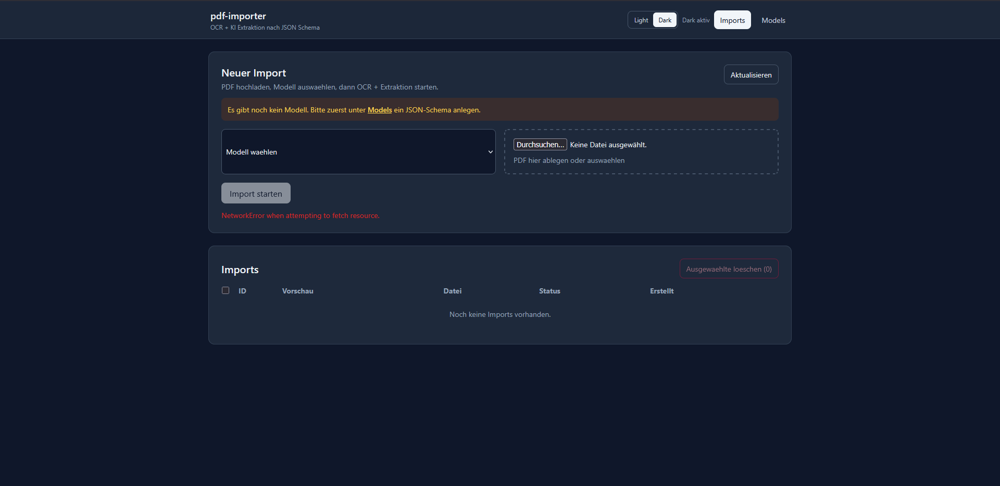

# PdfImporter

PdfImporter ist ein Projekt zur strukturierten Verarbeitung von PDF-Rechnungen. Das Repository enthält Bausteine für Datenhaltung, Konfiguration und ein Rechnungs-Schema für den Datenaustausch.



## Projektstruktur

- `src/db.py` – SQLite-Helfer zum Erstellen von Verbindungen und Initialisieren des Datenbankschemas.
- `schemas/invoice.schema.json` – JSON-Schema für ein generisches Rechnungsdokument.
- `pdf-importer/docker/docker-compose.yml` – Infrastruktur-Setup mit PostgreSQL und Redis.
- `pdf-importer/.env.example` – Beispiel-Konfiguration für API/Web (u. a. Datenbank, OpenAI-Modell, OCR-Sprache).
- `backend/` und `frontend/` – vorbereitete Verzeichnisse für API- und UI-Komponenten.

## Funktionen laut aktuellem Code

### 1) Datenbank-Initialisierung (SQLite)

In `src/db.py` sind zwei zentrale Funktionen implementiert:

- `create_connection(db_path)`
  - legt den Zielordner der DB-Datei an,
  - öffnet eine SQLite-Verbindung,
  - aktiviert Foreign Keys via `PRAGMA foreign_keys = ON`.

- `init_db(db_path)`
  - lädt SQL-DDL aus `db/schema.sql`,
  - führt das Schema per `executescript` aus.

Damit kann lokal schnell eine persistente SQLite-Datenbank für Entwicklung/Tests vorbereitet werden.

### 2) Rechnungs-Schema (JSON Schema 2020-12)

Das Schema in `schemas/invoice.schema.json` beschreibt ein strukturiertes Invoice-Objekt, u. a. mit:

- `document` (z. B. `document_id`, `issue_date`, `currency`),
- `seller` und `buyer` als Parteien,
- `line_items` mit Positionen,
- `totals` mit Summen,
- optionalen Metadaten und Confidence-Feld.

`additionalProperties: false` ist für viele Objekte gesetzt, wodurch die Struktur strikt validierbar bleibt.

### 3) Container-Infrastruktur

Die Compose-Datei startet:

- **PostgreSQL 16** auf Port `5432`,
- **Redis 7** auf Port `6379`.

Damit steht eine solide Basis für API- und Worker-Komponenten bereit.

## Konfiguration

Die Datei `pdf-importer/.env.example` enthält beispielhafte Variablen:

- `DATABASE_URL` (derzeit auf SQLite-Beispielpfad),
- `OPENAI_API_KEY`, `OPENAI_MODEL`,
- `OCR_LANG`, `LOG_LEVEL`,
- `VITE_API_BASE_URL` für das Frontend.

Empfohlen: Datei nach `.env` kopieren und projekt-/umgebungsspezifisch anpassen.

## Lokaler Start (Infrastruktur)

Voraussetzung: Docker + Docker Compose.

```bash
cd pdf-importer/docker
docker compose up -d
```

Stoppen:

```bash
docker compose down
```

## Nächste sinnvolle Schritte

1. `db/schema.sql` ergänzen bzw. prüfen, damit `init_db` vollständig lauffähig ist.
2. Backend-Endpunkte zur PDF-Verarbeitung und Schema-Validierung verbinden.
3. Frontend-Flow für Upload, Parsing und Ergebnisanzeige vervollständigen.
4. Optional: einheitlichen Start über Root-`Makefile`/Scripts etablieren.


## Contributions willkommen (AI-Features)

Da dieses Projekt öffentlich ist, freuen wir uns über Beiträge aus der Community.

Besonders willkommen sind Erweiterungen rund um AI, zum Beispiel:

- Unterstützung zusätzlicher AI-Anbieter (LLM/OCR),
- provider-unabhängige Abstraktionsschichten,
- bessere Prompting-/Extraction-Strategien,
- Evaluierung, Benchmarks und Qualitätsmetriken,
- Kosten-/Latenz-Optimierungen für verschiedene Modelle.

Wenn du eine Idee hast, erstelle gerne ein Issue oder direkt einen Pull Request.
 
